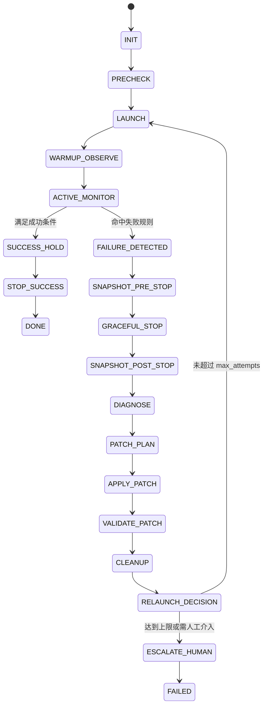

# ClawTeam Breakthrough Loop 外循环自动化技术设计文档

## 1. 文档目的

本文档定义一个可实现的外循环自动化方案，用于围绕 `clawteam-breakthrough-loop` 内循环构建一个稳定、可重复、可审计的自动修复流程。

目标场景：

- 启动 `snake-pvp-codex54-medium` 团队，团队严格按 `clawteam-breakthrough-loop` 规则运行。
- 外部程序持续监控团队行为与日志。
- 一旦发现团队没有按预期工作，自动停止团队，保留证据。
- 调用 `Claude Code` 对日志和配置做诊断，生成结构化执行报告。
- 再由 `Codex` 根据执行报告修改白名单范围内的配置文件。
- 修改后再次启动团队，重复该过程，直到团队终于能够按预期工作。
- 团队按预期工作后，自动停止团队，保留最终成功证据，等待人工验证配置文件。

本文档将作为后续实现的权威指引。

## 2. 背景与问题定义

当前仓库已经具备以下基础对象：

- `templates/breakthrough-loop.toml`
- `skills/clawteam-breakthrough-loop/`
- `runs/snake-pvp-codex54-medium/`

从现有运行分析可见，`snake-pvp-codex54-medium` 的失败模式不是“业务实现失败”，而是“团队协议失效”：

- `reviewer` 在未收到 revision 时错误地 `idle`
- `verifier` 在未收到 revision 时错误地 `idle`
- `explorer` 完成首轮探索后错误地 `idle/completed`
- gate 角色未持续消费 inbox
- `worker` 后续提交无法进入评审/验证闭环

因此，本设计的首要目标不是让产品功能一次做完，而是让团队运行协议先稳定成立。

## 3. 设计原则

### 3.1 核心原则

1. 外循环必须是确定性的状态机，而不是一个长对话 prompt。
2. 监控的原始数据采集和硬规则判定必须由脚本实现，不能依赖 AI 自己记住状态。
3. AI 负责三类高价值、不确定性任务：
   - 外循环总调度与综合决策
   - 诊断根因
   - 在白名单范围内生成修复补丁
4. 任何自动修复都必须可审计、可复盘、可限制边界。
5. 默认优先修协议与配置问题，不自动修改 `clawteam` 框架源码。
6. 外循环总调度使用更高推理强度，但不替代底层脚本监控。

### 3.2 当前已知事实

- `breakthrough-loop` 当前模板与参考规范里仍有“默认 4 轮”的历史内容。
- 本设计明确收敛为“默认 3 轮内循环”。
- 因此，本文档是目标设计；后续实施时需要同步更新模板、参考文档、提示文本和监控规则，消除历史不一致。

## 4. 默认运行规则

本节是必须固化进实现的默认规则。

### 4.1 外循环总调度默认规则

- 外循环总调度固定使用 `gpt-5.4`
- think 级别固定为“超高”，即 `xhigh`
- 该模型负责：
  - 监控结果的综合判断
  - warning 到 stop 的升级决策
  - relaunch 或人工升级判断
  - 外循环层的总调度总结
- 该模型不直接替代脚本执行原始监控采样，也不直接替代 `Claude Code` 诊断

### 4.2 团队执行默认规则

- `ClawTeam` 组建团队时，默认执行引擎为 `gpt-5.4`
- 默认 think 级别为 `medium`
- 默认目标是节省 token
- 在没有明确覆盖参数时，团队统一采用该默认配置

### 4.3 诊断默认规则

- `Claude Code` 诊断固定使用 `Opus 4.6`
- 诊断 think 级别固定为 `high`
- 该配置用于根因分析与执行报告生成

### 4.4 外循环默认规则

- 外部检测外循环默认最多执行 `3` 次 attempt
- 第 `3` 次 attempt 结束后仍失败，则自动退出并转人工处理

### 4.5 内循环默认规则

- `clawteam-breakthrough-loop` 内循环默认最多执行 `3` 轮
- 第 `3` 轮结束后若仍未形成有效闭环或未达到成功标准，则该次 attempt 视为失败
- 外循环与内循环都使用 `3` 作为默认上限，避免策略冲突

## 5. 目标与非目标

### 5.1 目标

本设计要实现以下能力：

1. 用一个 Python 程序作为统一入口启动全流程自动化
2. 自动拉起 `ClawTeam`
3. 自动监控团队是否遵守 `breakthrough-loop` 协议
4. 自动在失败时取证、停机、诊断、修配置、重启
5. 以最多 `3` 次 attempt 为上限反复迭代
6. 当团队“按预期工作”后自动停止，并输出最终报告

### 5.2 非目标

本设计暂不包含：

- 自动修改 `clawteam` 框架源码
- 自动保证最终产品业务功能完全正确
- 自动无限扩轮
- 自动多模型 AB 实验
- 自动并行修复多个互不相关问题
- 自动处理任意 repo 的任意复杂故障

## 6. 总体架构

系统分为五层：

1. `Python orchestrator`
2. `Scheduler LLM (gpt-5.4 / xhigh)`
3. `ClawTeam`
4. `Claude Code`
5. `Codex`

### 6.1 角色职责

#### A. Python orchestrator

唯一总控，负责：

- 状态机推进
- 命令调用
- 超时与失败判定
- 快照与取证
- 调用外循环总调度模型
- 调用诊断器
- 调用补丁执行器
- 校验补丁
- 触发重启或退出

#### B. Scheduler LLM

外循环总调度模型，固定配置为 `gpt-5.4 / xhigh`，负责：

- 解释脚本已采集的监控快照
- 对非确定性 warning 做综合判断
- 判断是继续观察、立即停止还是进入人工升级
- 为每个 attempt 生成调度层决策记录

它不直接读写团队 inbox，不直接替代脚本执行健康检查。

#### C. ClawTeam

被控系统，负责：

- 启动团队
- 管理 team/task/inbox/board
- 提供 JSON 状态信息
- 提供团队清理和快照恢复能力

#### D. Claude Code

诊断器，负责：

- 读取日志快照
- 读取模板与相关配置文件
- 分析失败根因
- 生成结构化执行报告

它不直接写文件，不直接重启团队。

#### E. Codex

修复执行器，负责：

- 读取执行报告
- 在白名单范围内修改配置文件
- 输出补丁执行日志

它不负责长期监控，不负责外循环编排。

## 7. 推荐实现目录

```text
automation/
  orchestrator.py
  cli.py
  state_machine.py
  health_rules.py
  snapshot.py
  scheduler.py
  diagnosis.py
  patch_executor.py
  validators.py
  models.py
  prompts/
    scheduler_decision.md
    diagnose_failure.md
    apply_patch.md
  schemas/
    execution_report.schema.json
    attempt_manifest.schema.json
    patch_plan.schema.json

runs/
  snake-pvp-codex54-medium/
    attempts/
      attempt-001/
        manifest.json
        scheduler_decision.json
        snapshot-pre-stop/
        snapshot-post-stop/
        execution_report.json
        patch_plan.json
        apply_log.json
        final_status.json
```

## 8. 对外入口设计

最终对外入口是执行一个 Python 程序，然后自动开始全流程。

推荐形式：

```bash
python automation/orchestrator.py run \
  --team snake-pvp-codex54-medium \
  --repo /absolute/path/to/repo
```

建议提供以下子命令：

- `run`：开始自动化外循环
- `resume`：从上一次中断的 attempt 继续
- `report`：汇总并输出最终结果
- `dry-run`：只做配置校验，不真正启动团队

### 8.1 入口默认行为

执行 `run` 后，程序自动完成以下步骤：

1. 预检查环境
2. 启动外循环总调度模型 `gpt-5.4 / xhigh`
3. 启动 `ClawTeam`
4. 监控团队运行
5. 若失败则取证并停止团队
6. 调用 `Claude Code` 诊断
7. 调用 `Codex` 修复白名单配置
8. 校验修复
9. 再次启动
10. 最多重复 `3` 次
11. 一旦判定“按预期工作”，停止团队并结束

## 9. 状态机设计

### 9.1 状态列表

- `INIT`
- `PRECHECK`
- `LAUNCH`
- `WARMUP_OBSERVE`
- `ACTIVE_MONITOR`
- `SUCCESS_HOLD`
- `STOP_SUCCESS`
- `DONE`
- `FAILURE_DETECTED`
- `SNAPSHOT_PRE_STOP`
- `GRACEFUL_STOP`
- `SNAPSHOT_POST_STOP`
- `DIAGNOSE`
- `PATCH_PLAN`
- `APPLY_PATCH`
- `VALIDATE_PATCH`
- `CLEANUP`
- `RELAUNCH_DECISION`
- `ESCALATE_HUMAN`
- `FAILED`

### 9.2 状态流转



### 9.3 各状态说明

#### INIT

初始化运行上下文，创建 `run_id`，准备 attempt 计数器和输出目录。

#### PRECHECK

检查：

- `clawteam` 命令可执行
- `codex` 命令可执行
- `claude` 命令可执行
- repo 路径存在
- 目标模板存在
- 模板文件可被 TOML 解析

#### LAUNCH

启动一个新 attempt 的团队。

默认参数：

- scheduler_model: `gpt-5.4`
- scheduler_reasoning_effort: `xhigh`
- model: `gpt-5.4`
- reasoning_effort: `medium`
- inner_max_rounds: `3`

#### WARMUP_OBSERVE

启动后前 `120` 秒为暖机观察窗口。

此阶段仅做确定性故障识别，不做激进误判。

#### ACTIVE_MONITOR

每 `30-60` 秒轮询团队状态，直到：

- 成功
- 失败
- 超时

说明：

- 原始数据采集和 P0 硬规则判定由脚本完成
- 外循环总调度模型 `gpt-5.4 / xhigh` 对 warning 聚合、观察延长、stop 建议做综合判断

#### SUCCESS_HOLD

当检测到团队已按预期工作后，不立即结束；继续观察 `3-5` 分钟，确认协议未再次漂移。

#### FAILURE_DETECTED

命中 P0/P1 失败判定，进入取证阶段。

其中：

- P0 可由脚本直接触发
- P1 建议经 `gpt-5.4 / xhigh` 综合确认后再 stop

#### SNAPSHOT_PRE_STOP

在真正停机前抓一份快照，保留失败现场。

#### GRACEFUL_STOP

先请求团队优雅停止；若超时，再执行强制 cleanup。

#### SNAPSHOT_POST_STOP

在停机后抓第二份快照，用于对比 stop 前后状态。

#### DIAGNOSE

调用 `Claude Code / Opus 4.6 / high` 对失败现场做诊断。

#### PATCH_PLAN

从执行报告中提取可执行补丁计划。

#### APPLY_PATCH

调用 `Codex` 或受控补丁器，在白名单文件上实施修复。

#### VALIDATE_PATCH

校验补丁结果：

- TOML 可解析
- schema 合法
- dry-run 合法

#### CLEANUP

清理本次 team 运行残留，准备进入下一次 attempt。

#### RELAUNCH_DECISION

若未到上限且报告建议可继续，则重启；否则转人工。

## 10. 监控输入源

监控必须基于只读数据源。

### 10.1 允许使用

- `clawteam --json board show <team>`
- `clawteam --json team status <team>`
- `clawteam --json task list <team>`
- `clawteam inbox peek <team> --agent <name>`
- `clawteam context diff <team>`

### 10.2 禁止使用

- 在监控逻辑中使用 `clawteam inbox receive`
- 仅通过 grep 文本日志做唯一判定
- 仅依赖 agent 的口头自报健康

原因：

- `inbox receive` 是破坏性消费，会篡改现场
- 文本 grep 难以稳定建模
- agent 自报可能延迟、遗漏或误导

### 10.3 调度层判定原则

外循环监控采用双层判定：

1. 脚本层：
   - 负责数据采集
   - 负责 P0 硬规则
   - 负责超时与 unread 计数
2. 调度层：
   - 使用 `gpt-5.4 / xhigh`
   - 只消费规范化快照，不直接消费破坏性命令结果
   - 负责 P1/P2 聚合判断、继续观察建议、stop 建议、人工升级建议

因此，“外部循环监控用的 gpt-5.4 使用超高 think 级别”在本设计中的准确含义是：

- 由 `gpt-5.4 / xhigh` 担任外循环总调度
- 但底层监控采样和硬规则仍由脚本保证确定性

## 11. 监控阶段划分

### 11.1 阶段 A：启动早期检查

时间窗：`T+0s` 到 `T+120s`

检查重点：

- supervisor 是否完成 4 份角色专属 kickoff
- reviewer / verifier / explorer 是否保持活跃等待，而非过早退出
- 是否出现明确的 `idle` / `completed` 违约事件

### 11.2 阶段 B：闭环形成检查

时间窗：`T+120s` 到第一次 worker submission 完成后

检查重点：

- explorer 是否输出结构化探索结果
- worker 是否正常推进并提交带 revision id 的产出
- reviewer / verifier inbox 是否在消费而不是堆积
- 若出现非致命异常，由 `gpt-5.4 / xhigh` 判断是继续观察还是升级 stop

### 11.3 阶段 C：成功稳定检查

时间窗：首次完整 gate 闭环完成后 `3-5` 分钟

检查重点：

- gate 角色是否仍在线
- 是否继续正常消费消息
- 是否没有新的协议违约

## 12. 成功判定

成功判定分三层，必须同时满足。

### 12.1 L1：存活性

必须满足：

- `reviewer`、`verifier`、`explorer` 在 kickoff 后 `120` 秒内没有进入 `idle`
- `reviewer`、`verifier`、`explorer` 在 kickoff 后 `120` 秒内没有标记 `completed`
- 任一关键 agent 最近事件时间没有超过超时阈值
- 如果 worker 已发送 heartbeat，则 supervisor 不应按 silent timeout 误判

### 12.2 L2：协议正确性

必须满足：

- supervisor 已发送 4 份 role-specific kickoff
- gate 角色有证据表明进入等待/消费状态
- worker 发出了至少一次带 `revision_id` 的正式提交
- reviewer 和 verifier 至少对同一个 revision 做出过正式处理
- supervisor 至少发布了一次与 gate 结果绑定的状态汇总或 revision brief

### 12.3 L3：稳定性

必须满足：

- 完整闭环出现后继续观察 `3-5` 分钟
- 没有关键角色提前退出
- 没有 inbox 持续单向堆积
- 没有明显 round 编号漂移或协议破坏

### 12.4 最终成功状态

当 L1 + L2 + L3 同时成立时，本次 attempt 标记为：

`success_ready_for_human_validation`

此时外循环自动停止团队并退出，等待人工验证配置文件。

## 13. 失败判定

失败判定分级如下。

### 13.1 P0：立即失败

出现以下任一情况即立即失败：

- reviewer 在 kickoff 后进入 `idle`
- verifier 在 kickoff 后进入 `idle`
- explorer 在 kickoff 后进入 `idle`
- reviewer 在未收到 shutdown 前进入 `completed`
- verifier 在未收到 shutdown 前进入 `completed`
- explorer 在未收到 shutdown 前进入 `completed`
- worker 提交后 reviewer / verifier 明显未消费 inbox 且持续堆积
- supervisor 在 gate 角色缺失的情况下继续推进闭环

### 13.2 P1：高概率失败

出现以下情况，若在观察窗内不自愈，则判为失败：

- explorer 只回文件名或 commit，没有结构化三方案正文
- worker 持续绕过 supervisor 直接向其他角色发非提交通知
- state summary 编号与 round 系统性错位

P1 的默认处理流程：

1. 脚本记录 warning
2. `gpt-5.4 / xhigh` 读取规范化快照
3. 输出 `continue_watch | stop_now | escalate_human`
4. orchestrator 按该结论推进状态机

### 13.3 P2：观察告警

记录但不单独触发 stop：

- supervisor 对 worker 超时探测过于激进
- 成本记录不完整
- 某些辅助消息格式不一致但不影响协议主路径

## 14. 核心健康规则

### 14.1 超时策略

#### Silent timeout

- 无任何通信或证据
- 阈值：`5` 分钟

#### Acknowledged-busy timeout

- agent 明确发送了 heartbeat 或“正在执行长任务”
- 阈值：`15` 分钟

### 14.2 Inbox 堆积策略

若 `reviewer` / `verifier` / `explorer` 的 inbox unread 持续增长，且没有消费证据，则视为高风险。

建议阈值：

- 连续两轮轮询增长
- 且总量超过 `3`

### 14.3 角色违约规则

对以下角色默认视为严重违约：

- reviewer 提前 idle
- verifier 提前 idle
- explorer 提前 idle

这正是当前已知故障的主路径。

## 15. 快照与取证规范

每次失败必须保留两份快照。

### 15.1 `snapshot-pre-stop/`

在 stop 之前保存：

- `board.json`
- `team_status.json`
- `tasks.json`
- `inbox_supervisor.txt`
- `inbox_worker.txt`
- `inbox_explorer.txt`
- `inbox_reviewer.txt`
- `inbox_verifier.txt`
- `context_diff_supervisor.txt`
- `context_diff_worker.txt`
- `context_diff_explorer.txt`
- `context_diff_reviewer.txt`
- `context_diff_verifier.txt`
- `template_copy.toml`
- `environment_summary.json`

### 15.2 `snapshot-post-stop/`

在 stop 之后保存：

- stop 后的 `board.json`
- stop 后的 `team_status.json`
- stop 后的 `tasks.json`
- `cleanup_result.json`

### 15.3 `manifest.json`

每次 attempt 必须有统一清单，记录：

- `run_id`
- `attempt_id`
- `team_name`
- `repo_path`
- `template_name`
- `template_hash`
- `team_model`
- `team_reasoning_effort`
- `scheduler_model`
- `scheduler_reasoning_effort`
- `diagnosis_model`
- `diagnosis_reasoning_effort`
- `inner_max_rounds`
- `outer_max_attempts`
- `started_at`
- `stopped_at`
- `failure_reason_code`

## 16. 数据模型

### 16.1 `attempt_manifest.json`

建议结构：

```json
{
  "run_id": "snake-pvp-codex54-medium",
  "attempt_id": "attempt-001",
  "team_name": "snake-pvp-codex54-medium-attempt-001",
  "repo_path": "/absolute/path/to/repo",
  "template_name": "breakthrough-loop",
  "template_hash": "sha256:...",
  "team_model": "gpt-5.4",
  "team_reasoning_effort": "medium",
  "scheduler_model": "gpt-5.4",
  "scheduler_reasoning_effort": "xhigh",
  "diagnosis_model": "opus-4.6",
  "diagnosis_reasoning_effort": "high",
  "inner_max_rounds": 3,
  "outer_max_attempts": 3,
  "started_at": "2026-04-09T04:21:13Z",
  "stopped_at": "2026-04-09T04:43:29Z",
  "status": "failed",
  "failure_reason_code": "reviewer_idle_after_kickoff"
}
```

### 16.2 `execution_report.json`

该文件由 `Claude Code` 生成。

建议结构：

```json
{
  "run_id": "snake-pvp-codex54-medium",
  "attempt_id": "attempt-003",
  "verdict": "config_issue",
  "confidence": 0.82,
  "problems": [
    {
      "id": "P0-reviewer-idle-after-kickoff",
      "severity": "P0",
      "component": "templates/breakthrough-loop.toml",
      "symptom": "reviewer entered idle before any revision arrived",
      "root_cause": "polling rule is not treated as first-class action",
      "evidence": [
        "snapshot-pre-stop/board.json",
        "snapshot-pre-stop/inbox_reviewer.txt"
      ],
      "proposed_fix_summary": "move polling command to first actionable line and add supervisor verification"
    }
  ],
  "patches": [
    {
      "target_file": "templates/breakthrough-loop.toml",
      "action": "replace_block",
      "anchor": "[[template.agents]] name = \"reviewer\"",
      "old_sha256": "sha256:...",
      "new_text": "..."
    }
  ],
  "relaunch": {
    "recommended": true,
    "change_team_name": true,
    "reasoning_effort": "medium",
    "notes": [
      "apply only P0 patches in this attempt"
    ]
  },
  "human_escalation": {
    "required": false,
    "reason": ""
  }
}
```

### 16.3 `patch_plan.json`

建议由 orchestrator 从 `execution_report.json` 归一化生成：

```json
{
  "attempt_id": "attempt-003",
  "safe_to_apply": true,
  "whitelist_only": true,
  "patches": [
    {
      "target_file": "templates/breakthrough-loop.toml",
      "action": "replace_block",
      "anchor": "[[template.agents]] name = \"reviewer\""
    }
  ]
}
```

### 16.4 `scheduler_decision.json`

建议为每轮监控决策保留一份调度层输出：

```json
{
  "attempt_id": "attempt-003",
  "tick_id": "tick-014",
  "scheduler_model": "gpt-5.4",
  "scheduler_reasoning_effort": "xhigh",
  "inputs": [
    "board.json",
    "team_status.json",
    "tasks.json"
  ],
  "decision": "stop_now",
  "confidence": 0.91,
  "reason": "reviewer and verifier inboxes keep growing without any consumption evidence",
  "next_state": "FAILURE_DETECTED"
}
```

此文件的价值在于：

- 复盘为什么 stop
- 审计调度模型是否过于激进
- 比较不同 attempt 的调度质量

## 17. Claude Code 诊断规范

### 17.1 固定模型策略

- model: `Opus 4.6`
- reasoning_effort: `high`

### 17.2 输入材料

诊断阶段应至少提供：

- `snapshot-pre-stop/`
- `snapshot-post-stop/`
- `manifest.json`
- 当前模板文件
- 相关参考规范
- 历史失败摘要

### 17.3 输出要求

必须输出机器可消费的 JSON，不允许自由散文作为主输出。

### 17.4 允许的 verdict

- `config_issue`
- `model_limit`
- `framework_bug`
- `inconclusive`

解释：

- `config_issue`：可通过模板、prompt、profile 或启动参数修复
- `model_limit`：当前 `gpt-5.4 / medium` 难以稳定完成该协议
- `framework_bug`：问题超出模板层，需改 `clawteam`
- `inconclusive`：证据不足，不应自动继续修

## 18. Codex 补丁执行规范

### 18.1 固定职责

`Codex` 只负责按报告修改白名单文件，不负责诊断和编排。

### 18.2 白名单文件

允许自动修改：

- `templates/breakthrough-loop.toml`
- `skills/clawteam-breakthrough-loop/assets/breakthrough-loop.toml`
- `skills/clawteam-breakthrough-loop/references/*.md`
- `automation/*.py`
- `automation/prompts/*`
- `automation/schemas/*`

禁止自动修改：

- `clawteam` 框架源码
- 与本问题无关的业务代码
- 非白名单仓库文件

### 18.3 应用原则

- 每次 attempt 默认只处理 P0
- 最多附带一个与 P0 直接相关的 P1
- 不能在一次失败中顺手做大规模重构
- 若补丁越权，直接转人工

## 19. 补丁校验规范

每次补丁应用完成后必须经过：

1. 文件存在性检查
2. TOML 解析检查
3. JSON schema 检查
4. dry-run 启动参数检查
5. 若改动涉及模板同步副本，则检查主副本一致性

若任一校验失败，则当前 attempt 直接终止并转人工。

## 20. 启动与停止策略

### 20.1 启动策略

每次 relaunch 都建议使用新的 team name：

- `snake-pvp-codex54-medium-attempt-001`
- `snake-pvp-codex54-medium-attempt-002`
- `snake-pvp-codex54-medium-attempt-003`

原因：

- 避免历史队列残留污染
- 保证证据隔离
- 便于复盘

### 20.2 停止策略

失败时按如下顺序执行：

1. 抓 `snapshot-pre-stop`
2. 请求优雅停止
3. 等待 stop 超时
4. 如有必要执行强制 cleanup
5. 抓 `snapshot-post-stop`

成功时也应主动停止团队，以便固定最终现场。

## 21. 典型外循环伪代码

```python
def run():
    ctx = init_run_context()
    precheck(ctx)
    init_scheduler(ctx, model="gpt-5.4", reasoning_effort="xhigh")

    for attempt in range(1, 4):
        attempt_ctx = start_attempt(ctx, attempt)
        launch_team(attempt_ctx)
        observe_warmup(attempt_ctx, seconds=120)

        result = monitor_team(attempt_ctx)

        if result.status == "success_ready_for_human_validation":
            stop_team_success(attempt_ctx)
            write_final_report(attempt_ctx, result)
            return 0

        snapshot_pre_stop(attempt_ctx)
        graceful_stop(attempt_ctx)
        snapshot_post_stop(attempt_ctx)

        report = diagnose_with_claude(attempt_ctx)
        if should_escalate_human(report, attempt):
            write_final_report(attempt_ctx, report)
            return 2

        patch_plan = build_patch_plan(report)
        apply_patch_with_codex(attempt_ctx, patch_plan)
        validate_patch(attempt_ctx)
        cleanup_attempt(attempt_ctx)

    write_run_failed(ctx)
    return 3
```

## 22. 最小可用版本边界

MVP 必须实现以下能力：

1. 单一入口 Python 程序
2. 固定支持一个团队目标
3. 默认模型固定为：
   - 外循环总调度：`gpt-5.4 / xhigh`
   - 团队：`gpt-5.4 / medium`
   - 诊断：`Opus 4.6 / high`
4. 固定上限：
   - 外循环：`3` attempts
   - 内循环：`3` rounds
5. 只读监控
6. 双快照取证
7. 结构化诊断报告
8. 白名单补丁执行
9. 补丁校验
10. 自动重启
11. 最终报告输出

MVP 暂不做：

- 多团队并发
- 自动升档为更高 think
- 自动模型切换
- 多方案 patch 决策树
- 自动框架修复
- 图形化编排 UI

## 23. 风险与缓解

### 23.1 误判风险

风险：

- 正常但较慢的行为被误判为失败

缓解：

- 设置暖机窗口
- 区分 `silent timeout` 与 `acknowledged-busy timeout`
- 仅对确定性违约立即 stop

### 23.2 过度修复风险

风险：

- 一次应用过多改动，引入新问题

缓解：

- 每次只修 P0
- 限定白名单
- 强制补丁校验

### 23.3 模型能力瓶颈

风险：

- `gpt-5.4 / medium` 对“持续 polling 而非 idle”理解仍不稳定

缓解：

- 在执行报告中允许返回 `model_limit`
- 命中后停止自动循环并转人工

### 23.4 框架级问题

风险：

- 问题其实在 `clawteam` 本身而不是模板

缓解：

- 允许 `framework_bug` verdict
- 一旦识别，不再自动 patch 模板层

## 24. 与当前仓库现状的差异

以下内容是已知差异，实施时必须统一：

1. 当前历史文档中存在 `MAX_ROUNDS = 4`
2. 本设计要求默认 `MAX_ROUNDS = 3`
3. 当前监控逻辑尚未形成独立外循环程序
4. 当前 `snake-pvp-codex54-medium` 的运行分析已证明：
   - reviewer/verifier/explorer 提前 idle 是主故障路径

因此，本文档不是对现状的描述，而是对目标实现的定义。

## 25. 实施顺序建议

推荐按以下顺序开发：

### 第一步：只做检测，不做修复

实现：

- `health_rules.py`
- `orchestrator.py` 的 `PRECHECK / LAUNCH / MONITOR / SNAPSHOT / STOP`

目标：

- 自动检测协议失效
- 自动输出失败快照

### 第二步：接入诊断

实现：

- `diagnosis.py`
- `execution_report.schema.json`

目标：

- 用 `Claude Code / Opus 4.6 / high` 输出结构化执行报告

### 第三步：接入自动修复

实现：

- `patch_executor.py`
- `validators.py`

目标：

- 在白名单内自动修改配置并通过校验

### 第四步：串联完整闭环

实现：

- 完整状态机
- relaunch 决策
- 最终报告输出

目标：

- 单命令启动完整自动化

## 26. 最终验收标准

外循环实现完成后，应满足以下验收条件：

1. 执行一个 Python 命令即可启动自动化
2. 默认使用：
   - `gpt-5.4 / xhigh` 做外循环总调度
   - `gpt-5.4 / medium` 拉团队
   - `Opus 4.6 / high` 做诊断
3. 外循环默认最多 `3` 次 attempt
4. 内循环默认最多 `3` 轮
5. 能稳定发现 reviewer/verifier/explorer 提前 idle 的故障
6. 失败后能自动保存证据
7. 能生成结构化执行报告
8. 能在白名单范围内应用修复
9. 成功时会自动停止团队并输出最终结论

## 27. 本文档的权威性说明

从本文档落地开始，后续实施应以本文档为准。

若出现下列冲突，以本文档优先：

- 历史参考文档中的旧轮数定义
- 模板中遗留的旧默认值
- 旧的 prompt 中与本设计不一致的表述

在实现阶段，应尽快把模板、规范文档、参考文档和自动化代码收敛到与本文档一致的状态。
